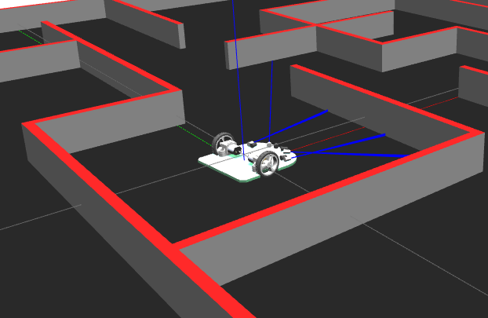

# **doogie_gazebo**

This ROS catkin package provides all launchfiles required in order to simulate **Doogie Mouse** in Gazebo.

**Keywords:** Micromouse, IEEE, Gazebo, ROS

**Author: [Caio Amaral] 
Affiliation: [BIR - Brazilian Institute of Robotics] 
Maintainer: Caio Amaral, caioaamaral@gmail.com**

### Supported Versions

The **doogie_gazebo** package has been tested under [ROS] Kinetic and Ubuntu 16.04 using **Gazebo 7.0.0** (the one that comes with [ROS] Kinetic Desktop-full installation). 

<!--  TODO -->

   

 

## Dependencies 
- [gazebo_ros] (provides all ROS message and service publishers for interfacing with Gazebo through ROS),
- [gazebo_ros_control] (package to integrate **ros_control** to Gazebo)
- [gazebo_plugins] (package to provide independent Gazebo plugins for sensors, models, etc.), 
- [doogie_description] (package with doogie URDF),
- [doogie_control] (package with doogie ros controllers);

# **Table of Contents**
- [**doogie_gazebo**](#doogiegazebo)
    - [Supported Versions](#supported-versions)
  - [Dependencies](#dependencies)
- [**Table of Contents**](#table-of-contents)
    - [Publications](#publications)
- [**Launch files**](#launch-files)
- [**Controllers Used**](#controllers-used)
- [**Topics**](#topics)
- [Gazebo Communication](#gazebo-communication)

 

### Publications

If you use this work in an academic context, please cite the following publication(s):

* C. Amaral, M. Santos Meneses: **DOOGIE MOUSE: UMA PLATAFORMA OPEN SOURCE PARA
APLICAÇÃO DE ALGORITMOS INICIAIS DE INTELIGÊNCIA
ARTIFICIAL EM ROBÓTICA MÓVEL**. V SIINTEC International Symposium on Innovation and Technology, 2019. ([PDF](/doogie_gazebo/docs/Paper_SIINTEC_V.pdf))

        @inproceedings{Doogie2019,
            author = {Amaral, C. and Santos Meneses, M. },
            booktitle = {V SIINTEC International Symposium on Innovation and Technology},
            title = {{DOOGIE MOUSE: UMA PLATAFORMA OPEN SOURCE PARA APLICAÇÃO DE ALGORITMOS INICIAIS DE INTELIGÊNCIA ARTIFICIAL EM ROBÓTICA MÓVEL}},
            publisher = {CIMATEC},
            year = {2019}
        }

____

# **Launch files**

1. **robot_launch.launch:** spawn Doogie Mouse at Gazebo empty.world

     - **Arguments to set Doogie Mouse spawn**

       - **`robot_name:`** specifie a nickname for Doogie Mouse when in gazebo.
      
          - Default: `doogie`
  
       - **`x:`** set x position coordinate where the robot will be spawned.
          - Default:`0.0`
       - **`y:`** set y position coordinate where the robot will be spawned.
          - Default:`0.0`
       - **`z:`** set z position coordinate where the robot will be spawned.
          - Default: `0.02` --> **This will probably change to '0.0' in final version**

     - **Arguments to set Maze spawn**
       - **`maze_name:`**specifie wich maze will be loaded and its name.

     - **Arguments to set Gazebo World**

       - **`paused:`** start Gazebo in a paused state. 

         - Default: `false`.
  
       - **`use_sim_time:`** tells if nodes will use time published at /clock.

          - Default: `true` 

       - **`gui:`** load Gazebo user interface display.
    
          - Default: `true`

       - **`debug:`** start Gazebo Server (gzserver) at debug mode using gdb.

          - Default: `false`

       - **`physics:`** specifie wich physics engine will be used by Gazebo.

          - Default: `ode`

       - **`verbose:`** run gzserver and Gazebo Client (gzclient)in verbose mode (i.e, printing errors and warnings to the terminal).
  
          - Default: `false`

       - **`world_name:`** tells gazebo which world will be loaded.
    
          - Default: `worlds/empty_world` 
    
        **Note:** the **world_name** path is with respect to **GAZEBO_RESOURCE_PATH** environmental variable.

 

2. **maze_launch.launch:** Only spawn the maze inside simulation, needs Gazebo launch before using it.
 
    - **Arguments to set Maze spawn**
 
       - **`maze_name:`** specifie wich maze will be loaded and its name. 

 

# **Controllers Used**

**doogie_gazebo** uses **gazebo_ros_control** to provide simulation some of the default controllers used by ROS. The **ros_controllers** used in this simulation are:

   - **move_base_controller** (diff_drive_controller/DiffDriveController)
   - **joint_publisher** (joint_state_controller/JointStateController)

Futhermore, this package also uses some sensors plugins from **gazebo_plugins**. Currently it's only using:

   - **gazebo_ros_range** (plugin used here to simulate the IR sensors)

**gazebo_ros_control** and each of the **gazebo_plugins** used here in the simulation was previously declared in Doogie Mouse's URDF, check [doogie_description], and defined in [doogie_control].

# **Topics**

- **`/move_base_controller/cmd_vel`** : ([geometry_msgs/Twist](https://docs.ros.org/kinetic/api/geometry_msgs/html/msg/Twist.html))

	Publish linear (m/s) and angular (rad/s) Doogie's velocity, by default it's using diff_drive_controller. **This is the one used to move Doogie Mouse in Gazebo by controlling its velocity.**

-**`/move_base_controller/odom`** : ([nav_msgs/Odometry](https://docs.ros.org/kinetic/api/nav_msgs/html/msg/Odometry.html))

   Publish Doogie's current estimated position and velocity.

- **`/joint_states`** : ([sensor_msgs/JoinState](https://docs.ros.org/kinetic/api/sensor_msgs/html/msg/JointState.html))
  
  Publish Doogie's wheels position (rad) and velocity (rad/s). **This is the one used to read Doogie Mouse velocity data.**

# Gazebo Communication

**gazebo_ros** provides its own communication interface, for more details you may refer to:

[Gazebo Topics](http://gazebosim.org/tutorials?tut=ros_comm&cat=connect_ros#GazeboSubscribedTopics)

[Gazebo Parameters](http://gazebosim.org/tutorials?tut=ros_comm&cat=connect_ros#GazeboPublishedParameters)

[Gazebo Services](http://gazebosim.org/tutorials?tut=ros_comm&cat=connect_ros#Services:Createanddestroymodelsinsimulation)

[doogie_description]:  https://github.com/Brazilian-Institute-of-Robotics/doogie_description

[doogie_control]:  https://github.com/Brazilian-Institute-of-Robotics/doogie_control

[doogie_simulators]: https://github.com/Brazilian-Institute-of-Robotics/doogie_simulators

[gazebo_ros]: http://wiki.ros.org/gazebo_ros

[gazebo_ros_control]: http://wiki.ros.org/gazebo_ros_control

[gazebo_plugins]: http://wiki.ros.org/gazebo_plugins

[ros_control / gazebo_ros_control]: http://gazebosim.org/tutorials?tut=ros_control

[ROS]: http://www.ros.org

[URDF]: http://wiki.ros.org/urdf 

[Xacro]: http://wiki.ros.org/xacro 

[Rviz]: http://wiki.ros.org/rviz

[BIR - Brazilian Institute of Robotics]: https://github.com/Brazilian-Institute-of-Robotics

[Caio Amaral]: https://github.com/caioaamaral